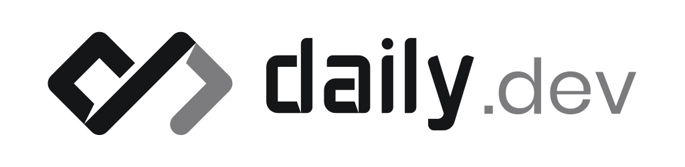
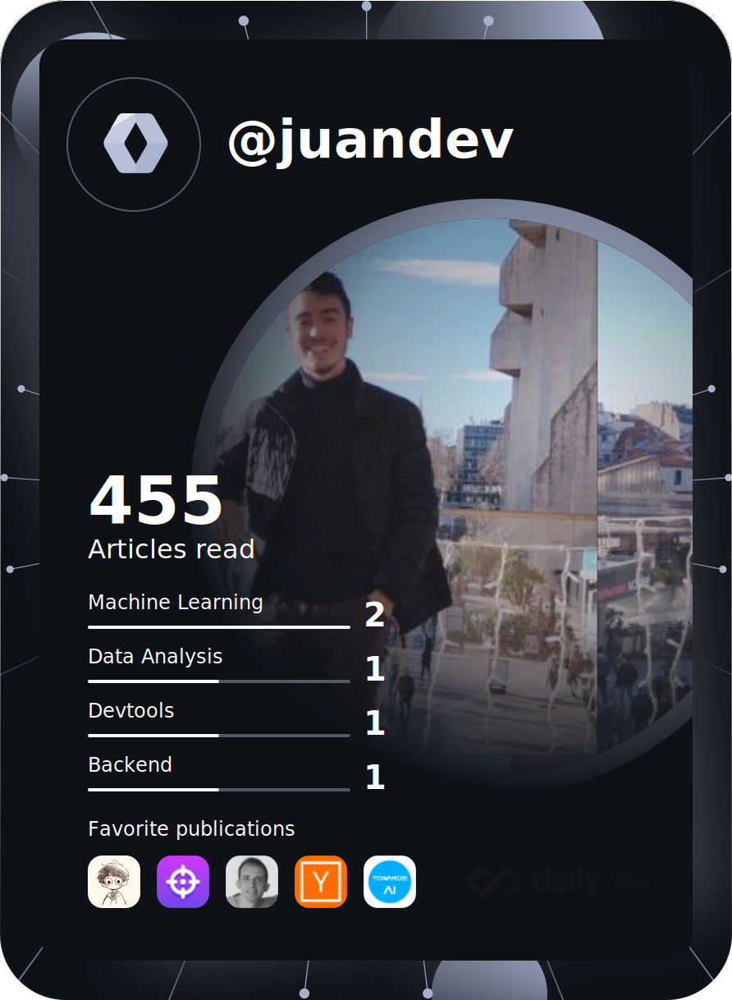

### Hi there, I'm Alexandre JUAN. An  A.I. & data science student from France  ! 

 
 
 
  
### About me

<samp>I am a 19 young student developer living in France. Currently 4th year EPITECH student :mortar_board:, I'm studying Artificial Intelligence in Jönköping University in Sweden. My favorite professional experience is when I worked as Machine Learning Engineer intern at <a href="https://www.inrae.fr/en" target="_blank">INRAe</a>. My job was to create a Machine Learning algorithm using biomedical data (<a href="https://www.nlm.nih.gov/research/umls/index.html" target="_blank">UMLS</a>) to <a href="https://github.com/sifrproject/UMLS-Types-assignor" target="_blank">assign semantic types to onthology concepts</a>.   Since I started to develop 5 years ago, I always enjoy learning new things/technologies/tricks :grinning:. I have been playing tennis since I was 12 years old :tennis:. My love for video games  has helped me to move into this fied. Programming is for me a therapy. Like, any kind of ideas or just wishes can be realized thanks to engineering and developing technologies. I wish to contribute one day to a project which will improve the human habits.</samp>

### [Epitech All Projects](https://github.com/Mitix-EPI/Epitech-All-Projects) :mortar_board:

<samp>I share and update the projects and the documentation of each of my projects on a regular basis.</samp>

### Languages and Tools:

<table border="0">
 <tr>
    <td><b style="font-size:30px">Languages / Framework / Technologies</b></td>
    <td><b style="font-size:30px">My favorite GIF ❤️</b></td>
 </tr>
 <tr>
    <td>
         

          
          
          
          
          
          
          
          
          
          
          
          
          
          
          
          
          
          
          
          
          
          
          
          
          
          
          
          
          
          
          
         

  </td>
  <td>
    
  </td>
 </tr>
</table>

|  |  |
|    :---:     |    :---:    |
|  |  |

📈 My GitHub Stats

 
 

